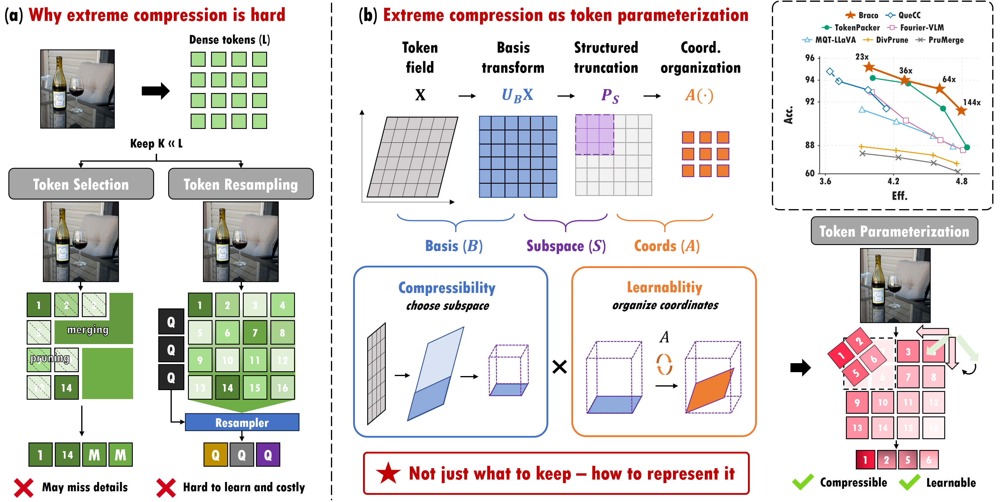
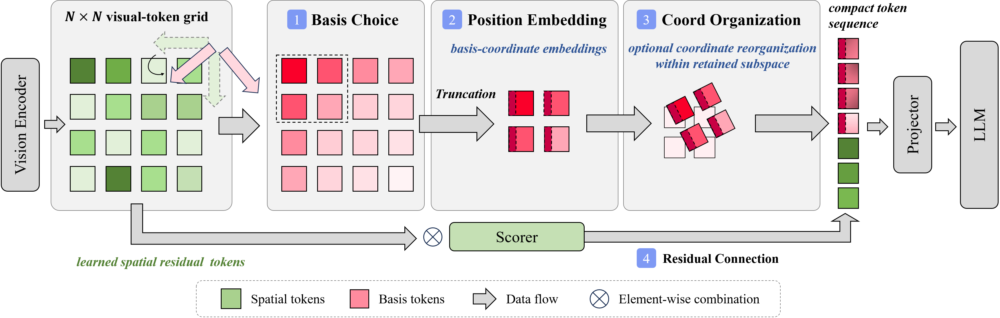

<h1 align="center">Beyond Selection: Token Parameterization for Extreme Visual Token Compression</h1>

<p align="center">
  
</p>

<p align="center"><strong>🌟 NeurIPS 2026 Spotlight</strong></p>

<p align="center">
  <a href="mailto:rzhong@zju.edu.cn">Rui Zhong</a> ·
  <a href="mailto:li.yu@zju.edu.cn">Yu Li</a> ·
  <a href="mailto:zyan2@zju.edu.cn">Zheyu Yan</a><sup>✉</sup> ·
  <a href="mailto:czhuo@zju.edu.cn">Cheng Zhuo</a><br>
  Zhejiang University
</p>

<p align="center">
  <a href="https://zrrraa.github.io/Braco/"></a>
  <a href="https://arxiv.org/abs/2609.35232"></a>
  <a href="https://huggingface.co/papers/2609.35232"></a>
  <br>
  <a href="https://github.com/zrrraa/Braco"></a>
  <a href="LICENSE"></a>
  <a href="src/braco/compressor.py"></a>
</p>

## 🔍 Overview

Official implementation of **Braco**, a lightweight visual-token compressor for vision-language models. Braco formulates extreme visual-token compression as a **token parameterization** problem, jointly addressing **compressibility** and **learnability** through a compact transform backbone, budget-dependent coordinate organization, and learned spatial residuals.



Braco compresses 576 visual tokens to **4, 9, 16, or 25 tokens**. At 25 tokens, it retains **95.2% of the uncompressed model's benchmark-normalized accuracy** in our main LLaVA-v1.5-7B comparison.

Braco has four components: structured DCT truncation, input-independent basis-coordinate embeddings, budget-dependent orthogonal coordinate organization, and sparse spatial residual pooling.



The transform backbone captures global information, while the spatial branch pools localized evidence. Spatial residuals are normalized and scaled, then concatenated with the backbone to form a compact sequence of **K = C² + S** tokens for projection into the LLM.

The standalone PyTorch implementation is [`src/braco/compressor.py`](src/braco/compressor.py). LLaVA integration files are provided under [`integrations/`](integrations/).

## 🛠️ Setup

Linux, CUDA 11.8, and Python 3.10.

```bash
conda env create -f environment.yml
conda activate braco-repro
python -m pip install -e .
python -m pip install ninja packaging
python -m pip install flash-attn==2.5.2 --no-build-isolation

export REPRO_ROOT=/path/to/experiment-workdir
export MODEL_ROOT=/path/to/models
export DATA_ROOT=/path/to/datasets
bash scripts/prepare_upstreams.sh
```

Prepare the Vicuna-7B, CLIP, and dataset files following the [usage guide](docs/usage.md).

## ⚙️ Training

Train both stages on eight GPUs. Choose a token budget of `4`, `9`, `16`, or `25`:

```bash
# Token budget 9, seed 0
CUDA_VISIBLE_DEVICES=0,1,2,3,4,5,6,7 bash scripts/train_braco.sh 9 0
```

For four GPUs, set `GRAD_ACCUM_STEPS=2` and `CUDA_VISIBLE_DEVICES=0,1,2,3`
to keep the same global batch sizes.

The full checkpoint is saved to `$REPRO_ROOT/outputs/braco/k9/seed0/stage2`.
See [training settings](configs/braco.yaml) and [benchmark evaluation](docs/usage.md#evaluation-workflow) for details.

## 💬 Inference

Ask a question about an image using a trained checkpoint on one CUDA GPU:

```bash
CUDA_VISIBLE_DEVICES=0 python examples/infer.py \
  --model-path "$REPRO_ROOT/outputs/braco/k9/seed0/stage2" \
  --image /path/to/image.jpg \
  --question "What is happening in this image?"
```

The example reads the token budget from the checkpoint and prints the answer.
Add `--output answer.json` to save it. The standalone PyTorch compressor is available in [`src/braco/compressor.py`](src/braco/compressor.py).

## 📖 Citation

```bibtex
@misc{zhong2026braco,
  title         = {Beyond Selection: Token Parameterization for Extreme Visual Token Compression},
  author        = {Zhong, Rui and Li, Yu and Yan, Zheyu and Zhuo, Cheng},
  year          = {2026},
  eprint        = {2609.35232},
  archivePrefix = {arXiv},
  primaryClass  = {cs.CV},
  url           = {https://arxiv.org/abs/2609.35232}
}
```

Released under [Apache-2.0](LICENSE). Built on [LLaVA](https://github.com/haotian-liu/LLaVA).
